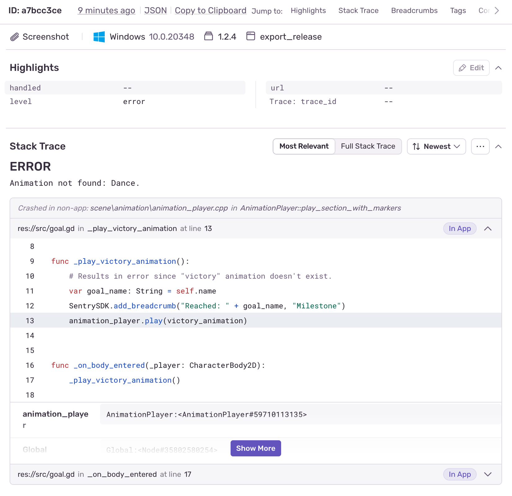

# Sentry for Godot Engine

Sentry for Godot helps you monitor your game's health during QA and after release. It provides insights into crash reports, script errors, hardware information, user feedback, attachments and more through real-time alerting and an intuitive web dashboard. With automatic error reporting, release tracking, and AI-assisted analysis, you can quickly identify, prioritize, and resolve issues for a better player experience.

**Architecture**: Built as a C++ GDExtension library using mature Sentry SDKs like [sentry-native](https://github.com/getsentry/sentry-native) as the foundation.

🚧 **Preview Phase** - This SDK is currently in 1.0 preview phase as we work towards a stable 1.0.0 release. While functional, some features may be incomplete, subject to change or missing.

**Feedback Welcome**: We'd love to hear about your experience! Share feedback and ask questions in [Discussions](https://github.com/getsentry/sentry-godot/discussions).

## Minimum supported Godot Engine

| SDK Version    | Required Godot Version |
|----------------|------------------------|
| `1.x` releases | Godot 4.5 or later     |
| `0.x` releases | Godot 4.3 or later     |

For upgrade instructions between major versions, see the [Migration Guide](https://docs.sentry.io/platforms/godot/migration/).

## Supported platforms and architectures

- **Windows**: x86_64, x86_32
- **Linux**: x86_64, x86_32
- **macOS**: universal (Intel and Apple Silicon)
- **Android**: arm64, arm32, x86_64
- **iOS**: device and simulator
- **Web**: expected in Q4 2025, after 1.0.0 stable
- **W4 console forks**: coming in 2026

Support for additional platforms and architectures may be added in future releases.

## Getting started

Pre-built extension libraries with the demo project are available in [**Releases**](https://github.com/getsentry/sentry-godot/releases), including 1.0.0 pre-release versions.

Check the official [Sentry SDK documentation](https://docs.sentry.io/platforms/godot/) to get started.

In the Godot editor, you can adjust options by going to `Project Settings -> Sentry -> Options`. Feel free to explore the demo `project/` for usage examples.

## Building from source

For build instructions, see our [**Contributing Guide**](https://github.com/getsentry/sentry-godot/blob/master/CONTRIBUTING.md#building-sdk).

## Contributing

We appreciate your contributions! Feel free to open issues for feature requests and ask questions in [**Discussions**](https://github.com/getsentry/sentry-godot/discussions). Your feedback is very much welcome!

Check out our [**Contributing Guide**](https://github.com/getsentry/sentry-godot/blob/master/CONTRIBUTING.md).
